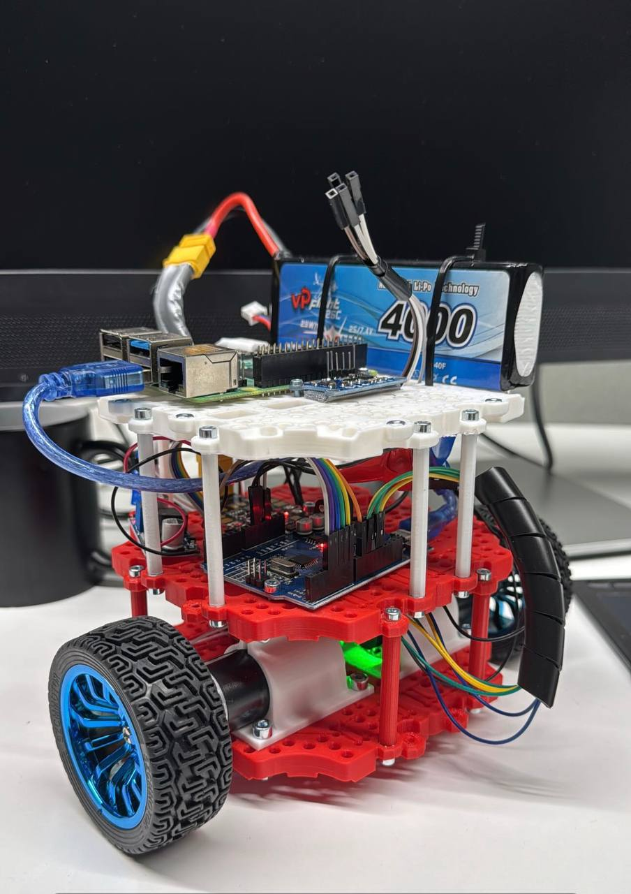

# Perceptrabot

Perceptrabot is a passion project that is mean to be used as a robotics guinea pig. It is inspired from the popular [TurtleBot Burger](https://robotis.us/turtlebot-3-burger-rpi4-4gb-us/). The goal is to explore different approaches to perception and navigation while making a contribution to the open source robotics community and potentially some academic publication in case the results allow for it. 

